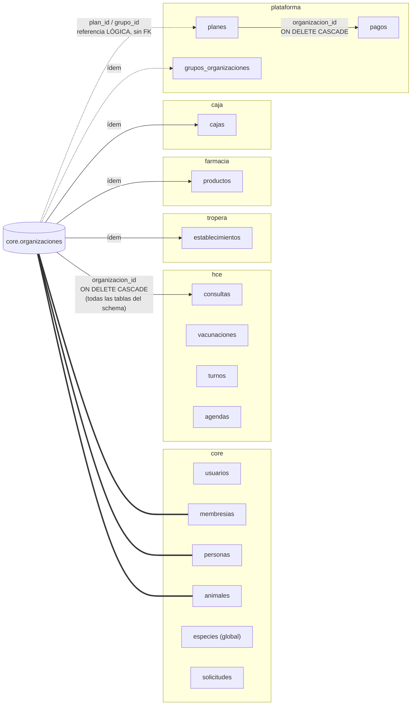
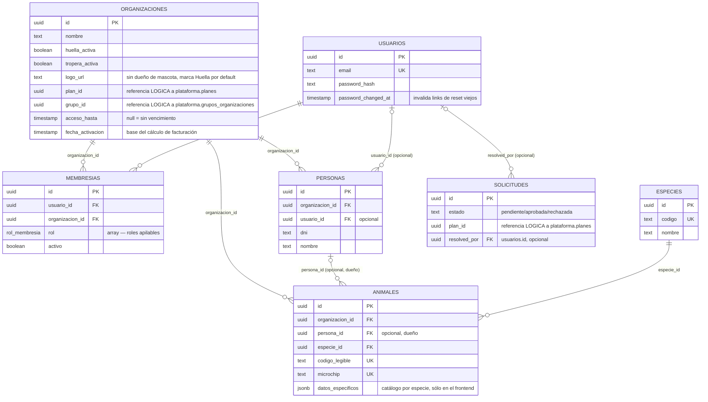
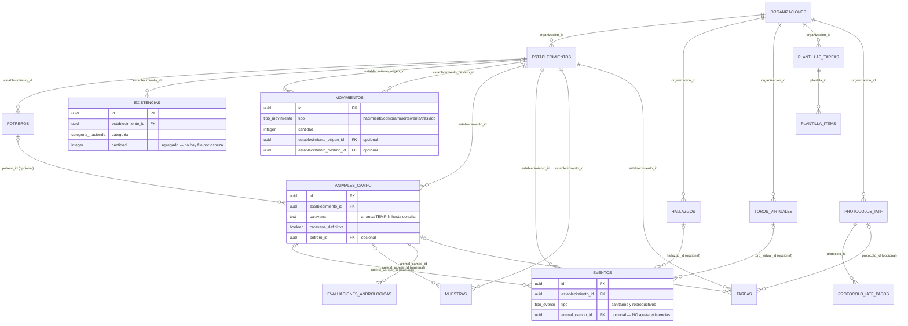
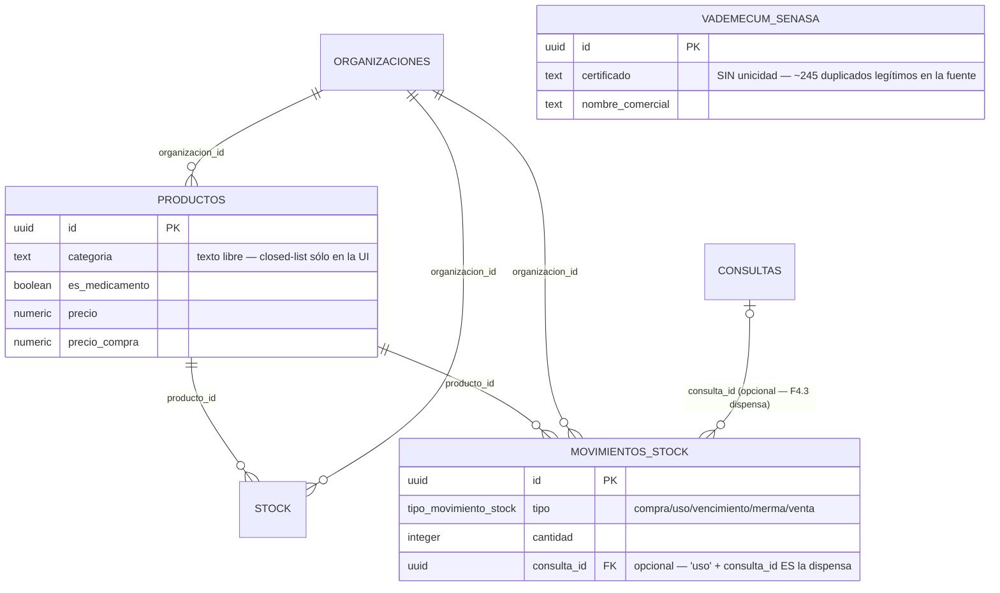
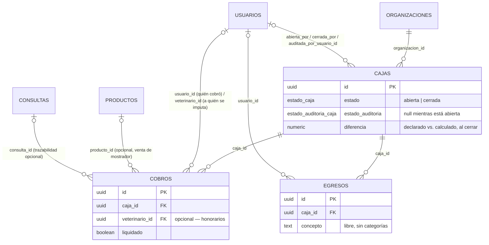
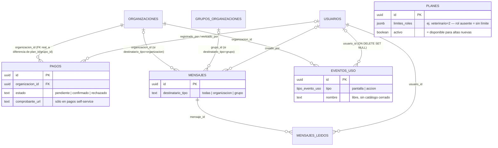

# 🗃️ Modelo de datos — relaciones entre schemas

> No existía este documento. `Estructura_Proyecto.md` ya lo señalaba: se había pensado un
> `db/schema/esquema_ecosistema.sql` como DDL de referencia de todos los schemas, pero nunca se
> creó — la fuente de verdad real siempre fue (y sigue siendo) el código Drizzle en
> `apps/backend/src/database/schema/*.ts` (`core.ts`, `hce.ts`, `tropera.ts`, `farmacia.ts`,
> `caja.ts`, `plataforma.ts`). Este documento es una **foto derivada** de esos archivos para
> entender rápido qué se relaciona con qué — si hay una duda puntual sobre un campo, tipo o
> default exacto, el `.ts` manda. Generado el 2026-09-05; si el schema cambia de forma
> significativa (tabla nueva, FK nueva, un patrón de referencia lógica nuevo), conviene
> actualizar este archivo en el mismo cambio — igual que se hace con `CHANGELOG.md`.

---

## 1. El patrón que se repite en todos lados

- **Multi-tenant por `organizacion_id`**: casi toda tabla de negocio (no los catálogos globales,
  ver más abajo) tiene una columna `organizacion_id` con `ON DELETE CASCADE` hacia
  `core.organizaciones`. El aislamiento entre organizaciones no depende de que cada query se
  acuerde de filtrar — lo fuerza `TenantGuard` en el borde HTTP (header `X-Organizacion-Id`,
  nunca en el body) antes de que el request llegue al service.
- **Soft delete + `updated_at` en casi todo**: `deleted_at` nullable en vez de `DELETE` real, y
  `updated_at` que se toca en cada `UPDATE`. No es sólo estilo — es lo que el motor de
  `sync/` (pull/push offline del mobile) necesita para saber qué cambió desde la última
  sincronización. Las pocas tablas sin esto (`cobros`, `egresos`, `pagos`,
  `evaluaciones_andrologicas`, `plantilla_items`, `protocolo_iatf_pasos`, `mensajes_leidos`,
  `eventos_uso`, `vademecum_senasa`) son ledgers que nunca se editan ni se borran una vez
  creados, o tablas fuera del alcance de `/sync` hoy.
- **Patrón "agregado + ledger"**: se repite en `tropera` (`existencias` = conteo actual,
  `movimientos` = historial que lo ajusta en la misma transacción) y en `farmacia` (`stock` +
  `movimientos_stock`, mismo criterio). La corrección directa sobre el agregado (sin pasar por
  el ledger) es una acción distinta y deliberadamente sin auditoría — no confundirlas.
- **Catálogos GLOBALES, sin `organizacion_id`**: `core.especies`, `hce.catalogo_vacunas`,
  `hce.catalogo_diagnosticos`, `farmacia.vademecum_senasa`. Son compartidos por toda la
  plataforma, de sólo lectura para las organizaciones, y en los tres casos de HCE/Farmacia son
  **sugerencias para autocompletar un campo de texto libre**, nunca una restricción ni una FK
  real desde la tabla que los usa.
- **Referencias lógicas (sin FK real a nivel DB)**: cuando dos schemas se importarían en
  círculo, o cuando el vínculo es deliberadamente flojo, la columna existe pero no hay
  `.references()` — ver la tabla de la sección 4. Esto importa para pruebas: la base **no** va a
  rechazar un `plan_id` inventado, hay que confiar en que el service lo validó.
- **Roles apilables**: `core.membresias.roles` es un arreglo de `core.rol_membresia`
  (`propietario`/`admin`/`capataz`/`veterinario`/`recepcion`), no una tabla intermedia — un
  usuario puede tener más de un rol en la misma organización sin cuentas separadas.

---

## 2. Mapa general (a nivel schema)

Detalle real (todas las FK, con cardinalidad) por schema en las secciones 3 a 8.

---

## 3. `core` — tronco común

**Nota**: `ESPECIES` es global (sin `organizacion_id`) — todas las organizaciones comparten el
mismo catálogo de especies, sembrado una vez (`db:seed`).

---

## 4. Referencias lógicas (sin FK real) — la lista completa

Estas columnas existen y se usan, pero Postgres **no** las valida — la integridad depende del
service. Todas nacen del mismo motivo: evitar un ciclo de imports entre los `schema/*.ts`
(un archivo que ya importa de otro no puede a la vez ser importado por él con una FK real hacia
atrás), salvo la última, que es una decisión de acoplamiento flojo explícita.

| Columna | "Apunta" a | Por qué no hay FK real |
|---|---|---|
| `core.organizaciones.plan_id` | `plataforma.planes.id` | `plataforma.ts` importa de `core.ts`; una FK en sentido inverso crearía un ciclo. |
| `core.organizaciones.grupo_id` | `plataforma.grupos_organizaciones.id` | Ídem. |
| `core.solicitudes.plan_id` | `plataforma.planes.id` | Ídem — se traslada tal cual a `organizaciones.plan_id` al aprobar. |
| `hce.vacunaciones.vademecum_id` | `farmacia.productos.id` | Ídem (y además: dispensar quedó ligado a la consulta, no a la vacunación puntual — ver F4.3 en `hce/`). |

Al probar algo que dependa de una de estas columnas, tené presente que la base **va a aceptar
un UUID que no existe** — sólo el código (`AdminService`, `SolicitudesService`) lo valida antes
de guardar.

---

## 5. `hce` — historia clínica electrónica

```mermaid
erDiagram
  ORGANIZACIONES ||--o{ CONSULTAS : "organizacion_id"
  ANIMALES ||--o{ CONSULTAS : "animal_id"
  USUARIOS |o--o{ CONSULTAS : "veterinario_id"

  ANIMALES ||--o{ VACUNACIONES : "animal_id"
  USUARIOS |o--o{ VACUNACIONES : "veterinario_id"

  ESPECIES ||--o{ CATALOGO_VACUNAS : "especie_id"
  ESPECIES ||--o{ CATALOGO_DIAGNOSTICOS : "especie_id"

  ORGANIZACIONES ||--o{ MACROS : "organizacion_id"

  ORGANIZACIONES ||--o{ INDICACIONES : "organizacion_id"
  CONSULTAS ||--o{ INDICACIONES : "consulta_id"
  ANIMALES ||--o{ INDICACIONES : "animal_id (denormalizado)"
  PRODUCTOS |o--o{ INDICACIONES : "producto_id (si origen=stock_interno)"

  ORGANIZACIONES ||--o{ AGENDAS : "organizacion_id"
  USUARIOS |o--o{ AGENDAS : "usuario_id (null = sin profesional)"
  AGENDAS ||--o{ AGENDA_BLOQUES : "agenda_id"
  AGENDAS ||--o{ AGENDA_EXCEPCIONES : "agenda_id"

  ORGANIZACIONES ||--o{ TURNOS : "organizacion_id"
  ANIMALES |o--o{ TURNOS : "animal_id"
  PERSONAS |o--o{ TURNOS : "persona_id (solicitante)"
  AGENDAS |o--o{ TURNOS : "agenda_id (opcional)"

  CONSULTAS {
    uuid id PK
    uuid organizacion_id FK
    uuid animal_id FK
    uuid veterinario_id FK "opcional"
    numeric costo "obligatorio a nivel DTO, no genera cobro automático en caja"
  }
  VACUNACIONES {
    uuid id PK
    uuid animal_id FK
    text producto "texto libre — ya cubre desparasitaciones, no hay `tipo` separado"
    uuid vademecum_id "referencia LOGICA, ver sección 4"
    date proxima_dosis
    timestamp recordatorio_descartado_en
  }
  INDICACIONES {
    uuid id PK
    uuid consulta_id FK
    uuid animal_id FK "denormalizado, el portal consulta sin pasar por consultas"
    origen_indicacion origen "stock_interno | receta_externa"
    uuid producto_id FK "sólo si origen=stock_interno"
  }
  AGENDAS {
    uuid id PK
    uuid usuario_id FK "opcional, null = agenda no médica (ej. peluquería)"
  }
  TURNOS {
    uuid id PK
    uuid animal_id FK "opcional"
    uuid persona_id FK "opcional"
    uuid agenda_id FK "opcional — turno sin agenda queda 100% libre"
    estado_turno estado
  }
```

`CATALOGO_VACUNAS`/`CATALOGO_DIAGNOSTICOS` son catálogos globales (por especie, no por
organización) — sólo alimentan sugerencias en `vacunaciones.producto`/`consultas.diagnostico`,
que siguen siendo texto libre sin FK hacia el catálogo.

---

## 6. `tropera` — ganadería

`EXISTENCIAS` (agregado por categoría) y `ANIMALES_CAMPO` (seguimiento individual, Fase E)
conviven **sin reconciliación automática entre ambos** — es un modelo híbrido deliberado, no una
inconsistencia: cargar un animal individual no descuenta el conteo agregado de su categoría.

---

## 7. `farmacia` — vademécum y stock

`VADEMECUM_SENASA` es global (7003 filas del registro nacional real), sin relación de datos con
`PRODUCTOS` — es sólo un buscador que autocompleta el nombre al dar de alta un producto propio.

---

## 8. `caja` — mostrador

`COBROS` y `EGRESOS` viven separados a propósito — nunca se listan juntos ni comparten tabla.

---

## 9. `plataforma` — la plataforma en sí, no una organización puntual

Ojo con la asimetría: `plataforma.pagos.organizacion_id` **sí** tiene FK real hacia
`core.organizaciones` (es `plataforma.ts` el que importa de `core.ts`, no al revés) — a
diferencia de `organizaciones.plan_id`/`grupo_id`, que van en sentido contrario y por eso son
lógicas (sección 4). Es fácil confundirlas porque ambas terminan relacionando las mismas dos
tablas.

---

## 10. Dónde mirar si esto no alcanza

- **Un campo puntual, tipo exacto, default**: el `.ts` del schema correspondiente en
  `apps/backend/src/database/schema/`.
- **Qué migración agregó qué**: `db/migrations/*.sql` (nombrados `000N_descripcion.sql`,
  aplicados en orden por `meta/_journal.json`) — o `CHANGELOG.md`, que suele explicar el *por
  qué* de cada uno.
- **Reglas de negocio que no se ven en el schema** (ej. "no se puede dejar la organización sin
  propietario activo", "un movimiento que deja stock negativo se rechaza"): viven en los
  `*.service.ts`, no en la definición de tablas — este documento es sólo de relaciones de datos.
